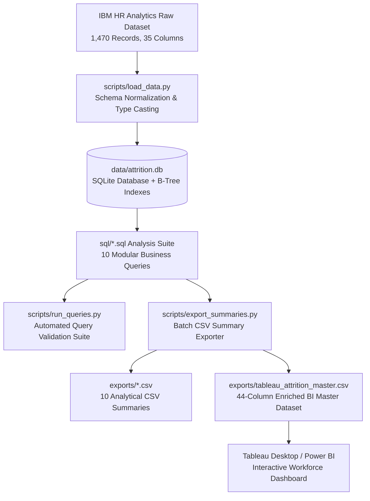

# 🏢 Employee Attrition & Workforce Intelligence Analytics
### *Uncovering Root Causes of Turnover & Engineering Data-Driven Retention Strategies*

<p align="center">
  
</p>

<p align="center">
  <a href="#-executive-kpi-scorecard"></a>
  <a href="#-executive-kpi-scorecard"></a>
  <a href="#-executive-kpi-scorecard"></a>
  <a href="https://www.sqlite.org/"></a>
  <a href="https://pandas.pydata.org/"></a>
  <a href="https://www.tableau.com/"></a>
</p>

---

## 📌 Executive Summary

Voluntary employee turnover imposes substantial direct and indirect costs on enterprises, ranging from replacement recruitment and onboarding overheads to lost institutional knowledge and team burnout.

This project delivers an end-to-end **Workforce Intelligence & Attrition Analysis** built upon the **IBM HR Analytics dataset (1,470 records across 35 workforce dimensions)**. Combining relational SQLite database modeling, a modular 10-query SQL analytics suite, Python ETL automation, and executive Tableau BI specifications, this study isolates the exact drivers behind why employees leave and equips HR leaders with empirical, high-ROI retention interventions.

> [!IMPORTANT]
> **Key Finding**: Turnover is concentrated in early-career roles subjected to heavy overtime and below-market compensation. **First-year employees working overtime experience a staggering 71.43% turnover rate**, compared to just **20.00%** without overtime.

---

## 🎯 Executive KPI Scorecard

| 👥 Total Headcount | 🚪 Voluntary Leavers | 📉 Attrition Rate | ⏳ Avg Leaver Tenure | 💵 Monthly Salary Gap |
| :---: | :---: | :---: | :---: | :---: |
| **1,470** | **237** | **16.12%** | **5.13 Years** | **-$2,045.65 / mo** |
| *Active: 1,233 (83.9%)* | *Voluntary departures* | *Industry benchmark: 14%* | *Retained avg: 7.37 yrs* | *-30.0% leaver deficit* |

---

## 📊 Deep-Dive Empirical Findings

All findings below were computed directly through deterministic SQL queries against [`data/attrition.db`](data/attrition.db):

### 1. 💰 The $2,045 Monthly Compensation Gap
Employees who leave earn an average of **$4,787.09/month** compared to **$6,832.74/month** for employees who stay—representing an organizational **30.0% salary deficit (-$2,045.65/month)**.

```
Retained Staff:  ████████████████████████ $6,833 / mo
Leavers:         █████████████████        $4,787 / mo  (-$2,045 deficit)
```

> [!NOTE]
> In entry-level Sales Representative roles (Level 2), departing staff were paid **50.65% less** than peers who remained ($2,086/mo vs $4,227/mo).

---

### 2. 🚨 Departmental & Job Role Turnover Hierarchy

```
Sales Representative:   ████████████████████ 39.76% (33 leavers)
Laboratory Technician:  ████████████ 23.94% (62 leavers - 26.2% of all company exits!)
Human Resources:        ████████████ 23.08% (12 leavers)
Sales Executive:        █████████ 17.48% (57 leavers)
Research Scientist:     ████████ 16.10% (47 leavers)
```

| Department | Job Role | Total Headcount | Leavers Count | Attrition % | Share of Total Exits |
| :--- | :--- | :---: | :---: | :---: | :---: |
| **Sales** | Sales Representative | 83 | 33 | **39.76%** | 13.92% |
| **Research & Development** | Laboratory Technician | 259 | 62 | **23.94%** | **26.16%** 🔴 |
| **Human Resources** | Human Resources | 52 | 12 | **23.08%** | 5.06% |
| **Sales** | Sales Executive | 326 | 57 | **17.48%** | 24.05% |
| **Research & Development** | Research Scientist | 292 | 47 | **16.10%** | 19.83% |
| **Research & Development** | Manufacturing Director | 145 | 10 | **6.90%** | 4.22% |
| **Management** | Manager | 102 | 5 | **4.90%** | 2.11% |

---

### 3. ⏱️ Overtime Burnout: The Critical Multiplier
Overtime dramatically multiplies flight risk, especially during the critical onboarding window (<2 years of tenure):

```
< 1 Yr Tenure + Overtime:     ██████████████████████████████ 71.43%  (10 of 14 left)
< 1 Yr Tenure + No Overtime:  ████████ 20.00%  (6 of 30 left)
1-2 Yrs Tenure + Overtime:    ████████████████████ 47.78%  (43 of 90 left)
1-2 Yrs Tenure + No Overtime: ███████ 16.48%  (29 of 176 left)
```

> [!WARNING]
> Early-career employees subjected to mandatory overtime are **3.5x more likely to leave** than their peers with sustainable workloads.

---

### 4. 🚗 Commute Distance & Travel Friction
- Employees living **26+ miles from the office** who **Travel Frequently** experience a **41.18% attrition rate** (14 of 34).
- In contrast, employees living near the office (1-5 miles) who do not travel experience an attrition rate of only **3.17%** (2 of 63).

---

### 5. 👥 Managerial Transitions as Vulnerability Windows
- **31.10% of employees** who have been with their current manager for **less than 1 year** leave the company, even if they received a promotion that same year.
- This demonstrates that **managerial turnover disrupts psychological safety**, requiring proactive HR engagement during leadership changes.

---

### 6. 🎯 High-Risk Flight Segments Leaderboard

| Rank | Multi-Factor Cohort Profile | Headcount | Leavers | Attrition % |
| :---: | :--- | :---: | :---: | :---: |
| 🥇 | **Sales Rep + Overtime + Low Income (<$3.5k) + Early Career (<=2 yrs)** | 10 | 8 | **80.00%** |
| 🥈 | **Lab Tech + Overtime + Low Income (<$3.5k) + Early Career (<=2 yrs)** | 21 | 15 | **71.43%** |
| 🥉 | **Research Scientist + Overtime + Low Income (<$3.5k) + Early Career (<=2 yrs)** | 24 | 13 | **54.17%** |

---

## 💡 Strategic HR Retention Playbook

```
┌─────────────────────────────────────────────────────────────────────────────────────────┐
│                              ACTIONABLE HR INTERVENTIONS                                 │
├─────────────────────────────────────────────────────────────────────────────────────────┤
│ 1. 🛑 Mandatory Overtime Caps for New Hires (<24 Months Tenure)                         │
│    Implement policy guardrails capping weekly overtime hours for new employees to        │
│    extinguish the 71.4% first-year turnover surge.                                      │
│                                                                                         │
│ 2. 💵 Junior Technical Compensation Parity Adjustments                                  │
│    Conduct equity reviews for Level 1/2 Laboratory Technicians and Sales Reps earning    │
│    under $3,500/mo to close the 30.0% salary deficit against competitors.               │
│                                                                                         │
│ 3. 🤝 Formalized 90-Day Manager Transition Framework                                    │
│    Introduce structured 30/60/90 day check-ins whenever an employee transitions to a    │
│    new manager to address the 31.1% leadership-change attrition peak.                   │
│                                                                                         │
│ 4. 🚆 Commute Flexibility & Remote Options for Frequent Travelers                       │
│    Grant hybrid work allowances for staff commuting >25 miles who travel frequently.     │
└─────────────────────────────────────────────────────────────────────────────────────────┘
```

---

## 🏗️ Technical Architecture & Pipeline



---

## 📂 Repository File Index

```
Employee-Attrition-Workforce-Analytics/
├── data/
│   ├── raw_attrition.csv                  # Raw IBM HR Analytics CSV dataset (1,470 rows)
│   ├── schema.sql                         # Typed SQLite DDL with integrity constraints & indexes
│   └── attrition.db                       # Normalized relational SQLite database
├── sql/
│   ├── 01_overall_attrition_kpis.sql      # Macro turnover, headcount, & compensation benchmarks
│   ├── 02_attrition_by_dept_and_role.sql  # Turnover rates & leaver volume by department & role
│   ├── 03_income_comparison_leavers_vs_stayed.sql  # Income deficit & pay disparity across job levels
│   ├── 04_attrition_by_overtime_and_tenure.sql     # Compounded interaction of overtime and tenure
│   ├── 05_job_satisfaction_and_worklife_balance.sql# Employee sentiment & balance correlation
│   ├── 06_distance_and_business_travel_impact.sql  # Commute distance and travel friction matrix
│   ├── 07_promotions_and_time_with_curr_manager.sql# Career progression and manager tenure dynamics
│   ├── 08_top_flight_risk_segments.sql    # Multi-variable high-risk employee segments
│   ├── 09_age_and_education_attrition_matrix.sql   # Generational cohort & academic background matrix
│   └── 10_salary_hike_and_performance_impact.sql   # Merit increase percentages vs performance rating
├── scripts/
│   ├── load_data.py                       # Ingestion, data cleaning, and database builder
│   ├── run_queries.py                     # SQL validation test suite runner
│   └── export_summaries.py                # Automated CSV exporter & Tableau master dataset builder
├── exports/
│   ├── tableau_attrition_master.csv       # Flat enriched master dataset for BI tools (1,470 records)
│   ├── summary_01_kpis.csv ... summary_10_salary_hike_performance.csv # Modular analytical summaries
├── docs/
│   ├── assets/
│   │   └── dashboard_preview.png          # High-resolution Tableau BI dashboard preview
│   └── tableau_dashboard_spec.md          # Tableau visual architecture, KPI layout, & LOD formulas
└── README.md                              # Portfolio documentation & business intelligence report
```

---

## 📊 Tableau BI Dashboard Specifications

A complete engineering specification is provided in [`docs/tableau_dashboard_spec.md`](docs/tableau_dashboard_spec.md).

### Pre-built Native Tableau LOD Calculations:
```tableau
// 1. Organization Baseline Turnover Rate (Fixed LOD)
{ FIXED : SUM([attrition_flag]) / COUNT([employee_id]) }

// 2. Department-Specific Attrition Rate (Fixed LOD)
{ FIXED [department] : SUM([attrition_flag]) / COUNT([employee_id]) }

// 3. Role-Level Monthly Compensation Gap ($)
{ FIXED [job_role], [job_level] : 
    AVG(IIF([attrition]='No', [monthly_income], NULL)) - 
    AVG(IIF([attrition]='Yes', [monthly_income], NULL)) 
}
```

---

## 🚀 Reproduction & Setup Guide

### 1. Prerequisites
- Python 3.8+
- SQLite3 (built into Python standard library)
- Required dependency: `pandas`

```bash
pip install pandas
```

### 2. Step-by-Step Execution

```bash
# Step 1: Ingest raw data, apply schema DDL, and build SQLite database
python scripts/load_data.py

# Step 2: Validate all 10 SQL analytical queries against the database
python scripts/run_queries.py

# Step 3: Run the export pipeline to generate summary CSVs and the Tableau extract
python scripts/export_summaries.py
```

---

## 🛠️ Data Analyst Skills Demonstrated

- **Relational Data Modeling**: Typed DDL schemas, primary keys, `CHECK` constraints, composite analytical B-Tree indexes.
- **Advanced SQL Querying**: CTEs, multi-table unions, conditional aggregation (`CASE WHEN`), window partitioning, null-safe arithmetic.
- **Data Engineering & ETL**: Python automation pipelines, data validation, automated CSV generation.
- **Business Intelligence (BI)**: Executive KPI scorecards, visual hierarchy, Level-of-Detail (LOD) formulas, data-driven HR strategy synthesis.

---

## 📄 License & Attribution
- Dataset: [IBM HR Analytics Employee Attrition & Performance Dataset](https://www.kaggle.com/datasets/pavansubhasht/ibm-hr-analytics-attrition-dataset).
- Repository distributed under the [MIT License](LICENSE).
