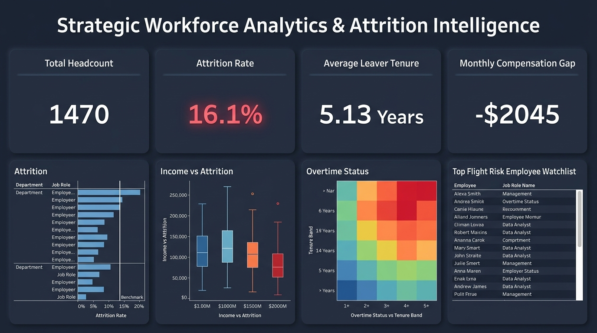

# Tableau BI Dashboard Specification: Employee Attrition & Workforce Intelligence

## 1. Executive Summary & Objective
- **Dashboard Title**: Strategic Workforce Analytics & Attrition Intelligence
- **Target Audience**: Chief Human Resources Officer (CHRO), VP of Talent, HR Business Partners (HRBPs), Department Directors.
- **Primary Objective**: Enable executive leadership and talent managers to monitor baseline turnover, pinpoint high-risk employee segments, evaluate compensation equity vs flight risk, and enact proactive retention interventions before key talent departs.
- **Data Source**: [`exports/tableau_attrition_master.csv`](file:///c:/Users/KHUSHI/Downloads/project%20emp/exports/tableau_attrition_master.csv) (1,470 records, 44 dimension & measure columns).



---

## 2. Visual Architecture & Layout Grid

The dashboard layout is designed according to a standard 12-column executive BI grid (1920x1080 or 1366x768 responsive layout):

```
+---------------------------------------------------------------------------------------------------+
|  HEADER: Strategic Workforce Analytics & Attrition Intelligence          [Last Refresh: Active DB]|
+---------------------------------------------------------------------------------------------------+
|  GLOBAL FILTER PANEL: [Department]  |  [Job Role]  |  [Overtime]  |  [Travel]  |  [Tenure Band]    |
+---------------------------------------------------------------------------------------------------+
|  KPI CARDS (Top Row - 4 Cards):                                                                   |
|  [ 1. Total Headcount ]  [ 2. Attrition Rate % ]  [ 3. Avg Leaver Tenure ]  [ 4. Monthly Comp Gap]|
|    1,470 Employees          16.12% (+2.1% vs tgt)      5.13 Years (-2.24y)       -$2,045 (-30.0%) |
+-------------------------------------------------+-------------------------------------------------+
|  CHART 1: Attrition Rate by Dept & Job Role     |  CHART 2: Monthly Income vs Attrition by Level  |
|  (Horizontal Clustered Bar + Target Line)       |  (Box Plot / Jittered Distribution by Role)     |
|                                                 |                                                 |
+-------------------------------------------------+-------------------------------------------------+
|  CHART 3: Compounded Risk: Overtime & Tenure   |  CHART 4: Top Flight-Risk Workforce Segments    |
|  (Heatmap Matrix with % Attrition Gradient)     |  (Ranked Risk Table / Actionable Watchlist)     |
|                                                 |                                                 |
+-------------------------------------------------+-------------------------------------------------+
```

---

## 3. Component & Visualization Specifications

### A. Top Executive KPI Cards (4 Tiles)

| KPI Card | Formula / Measure | Formatter | Benchmark / Context Reference |
| :--- | :--- | :--- | :--- |
| **1. Total Headcount** | `COUNT([Employee Id])` | Integer (`#,##0`) | Total active & past workforce (1,470) |
| **2. Attrition Rate** | `SUM([Attrition Flag]) / COUNT([Employee Id])` | Percentage (`0.0%`) | Target threshold: 14.0% (Current: 16.1%) |
| **3. Avg Tenure of Leavers**| `AVG(IF [Attrition] = 'Yes' THEN [Years At Company] END)` | Decimal (`0.00`) Yrs | Benchmark: 7.37 yrs for retained staff (Delta: -2.24 yrs) |
| **4. Compensation Gap** | `AVG(IF [Attrition]='No' THEN [Monthly Income] END) - AVG(IF [Attrition]='Yes' THEN [Monthly Income] END)` | Currency (`$#,##0`) | Leavers earn $4,787 vs $6,833 for retained (-$2,045 / -30.0%) |

---

### B. Core Visualizations

#### Chart 1: Attrition Rate & Leavers Volume by Department & Job Role
- **Type**: Dual-Axis Horizontal Bar Chart.
- **Rows**: `[Department]`, `[Job Role]`.
- **Columns (Axis 1)**: `[Attrition Rate %]` (Bar Mark, colored by threshold).
- **Columns (Axis 2)**: `[Leavers Count]` (Circle / Gantt Mark showing absolute volume).
- **Reference Line**: Organization-wide average attrition (16.12%).
- **Insight**: Highlights that *Sales Representatives* have the highest turnover rate (39.76%), while *Laboratory Technicians* generate the highest absolute loss volume (62 leavers, 26.16% of all leavers).

#### Chart 2: Monthly Income Distribution: Leavers vs Retained by Job Level
- **Type**: Box & Whisker Plot with Jittered Employee Scatter Points.
- **Columns**: `[Job Level]`, `[Attrition]`.
- **Rows**: `[Monthly Income]`.
- **Color**: `[Attrition]` (Teal `#0D9488` for Stayed, Crimson `#E11D48` for Leavers).
- **Detail**: `[Employee Id]`, `[Job Role]`.
- **Tooltip**: Employee ID, Role, Level, Monthly Income, Percent Salary Hike, Performance Rating.
- **Insight**: Proves that across Junior and Mid-levels (Job Levels 1-3), leavers consistently cluster in the bottom 25th percentile of compensation.

#### Chart 3: Compounded Risk Matrix (Overtime Status vs Tenure Band)
- **Type**: Heatmap / Color Matrix.
- **Rows**: `[Tenure Band]` (`< 1 Year`, `1-2 Years`, `3-5 Years`, `6-10 Years`, `10+ Years`).
- **Columns**: `[Overtime]` (`Yes`, `No`).
- **Color Metric**: `[Attrition Rate %]` (Continuous sequential palette: Light Gray to Deep Crimson).
- **Label**: `[Attrition Rate %]` + `SUM([Attrition Flag])` leavers count.
- **Insight**: Visualizes extreme vulnerability in new hires working overtime (<1 yr tenure + Overtime = **71.43% attrition rate**).

#### Chart 4: Top Flight-Risk Employee Watchlist
- **Type**: Interactive Data Table with conditional color alerts.
- **Dimensions**: `[Job Role]`, `[Overtime]`, `[Income Bracket]`, `[Tenure Band]`, `[Stock Option Level]`.
- **Measures**: `[Headcount]`, `[Leavers]`, `[Attrition Rate %]`, `[Avg Job Satisfaction]`.
- **Sorting**: Descending by `[Attrition Rate %]` where Headcount >= 10.
- **Action**: Clicking a row cross-filters the entire dashboard to isolate that risk cohort.

---

## 4. Interactive Filter Panel & Global Parameters

| Filter Dimension | Control Type | Default Selection | Behavior |
| :--- | :--- | :--- | :--- |
| **Department** | Multiple Values (Dropdown) | (All) | Filters all sheets on dashboard |
| **Job Role** | Multiple Values (Dropdown) | (All) | Dynamically filtered by Department |
| **Overtime** | Radio / Single Value List | (All) | Instant toggle (All, Yes, No) |
| **Business Travel** | Multiple Values (List) | (All) | Isolates Non-Travel, Travel Rarely, Travel Frequently |
| **Tenure Band** | Multiple Values (Dropdown) | (All) | Filter by years of experience |
| **Income Bracket** | Multiple Values (Dropdown) | (All) | Filter by salary tiers |

---

## 5. Tableau Calculated Fields & LOD Expressions

Include these formulas directly in Tableau:

```tableau
// 1. Overall Attrition Rate
SUM([attrition_flag]) / COUNT([employee_id])

// 2. Organization Baseline Attrition Rate (Fixed Level of Detail)
{ FIXED : SUM([attrition_flag]) / COUNT([employee_id]) }

// 3. Department Attrition Rate (LOD)
{ FIXED [department] : SUM([attrition_flag]) / COUNT([employee_id]) }

// 4. Monthly Income Gap ($)
{ FIXED [job_role], [job_level] : 
    AVG(IIF([attrition]='No', [monthly_income], NULL)) - 
    AVG(IIF([attrition]='Yes', [monthly_income], NULL)) 
}

// 5. Flight Risk Severity Indicator
IF [overtime] = 'Yes' AND [years_at_company] <= 2 AND [monthly_income] < 3500 THEN 'Critical Flight Risk (Red)'
ELSEIF [overtime] = 'Yes' OR [job_satisfaction] = 1 THEN 'Elevated Risk (Amber)'
ELSE 'Standard Retention (Green)'
END
```

---

## 6. Visual Theme & Design Tokens

- **Background**: Modern Executive Neutral (`#F8FAFC` Light Mode / `#0F172A` Dark Mode).
- **Card Containers**: Crisp White (`#FFFFFF`) with subtle 1px border (`#E2E8F0`) and 8px border radius.
- **Color Encoding**:
  - **Retained / Baseline**: Deep Slate Navy (`#1E293B`) or Muted Teal (`#0D9488`)
  - **Attrition / Leavers**: High-contrast Crimson Rose (`#E11D48`)
  - **Neutral Benchmark Reference**: Slate Gray (`#64748B`)
- **Typography**: `Inter` / `Segoe UI` (18pt Bold for Title, 22pt Bold for KPI values, 10pt Regular for labels and axes).
